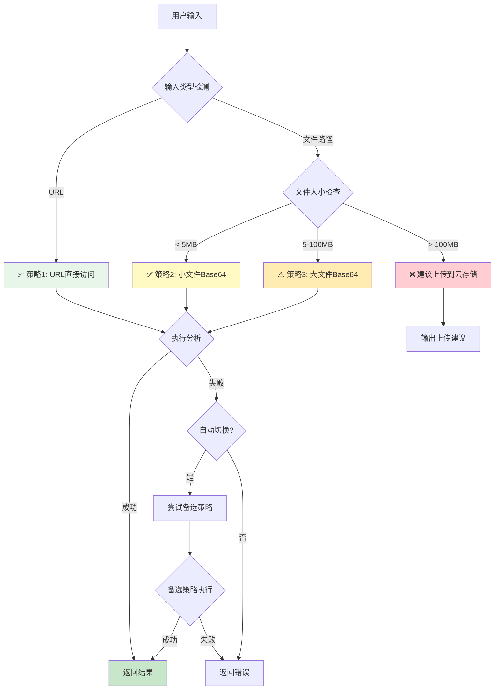
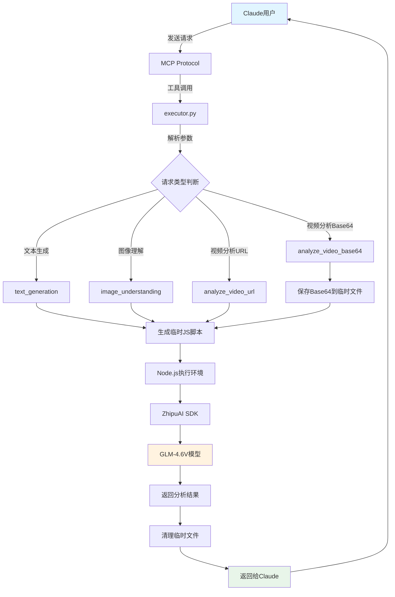
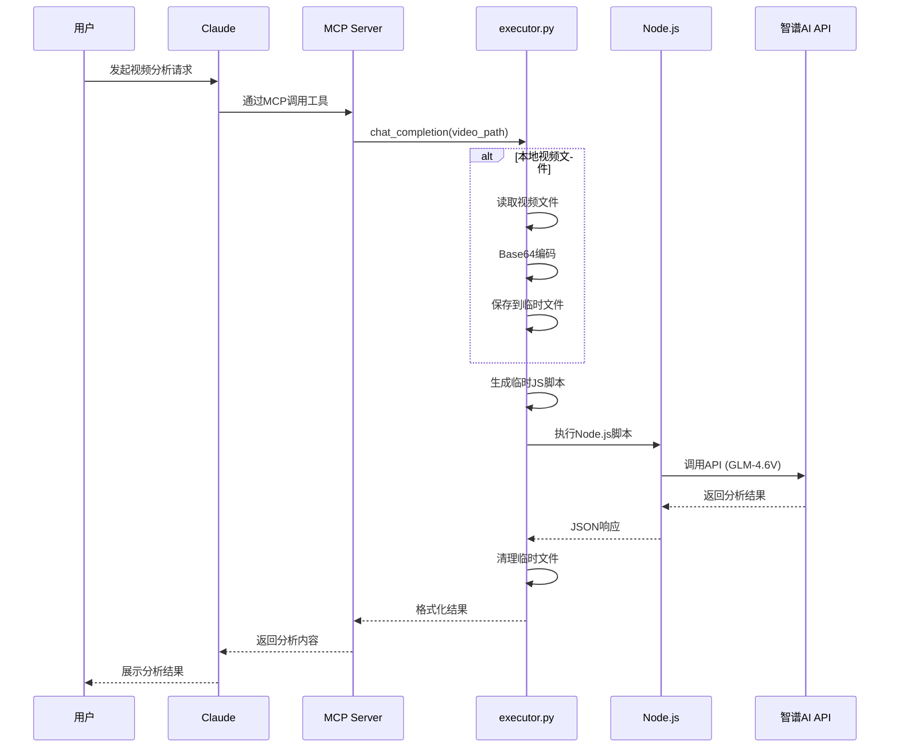
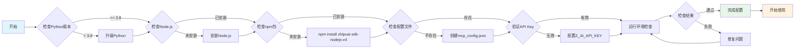

# ZAI Plus Skill

> 智谱AI多模态分析技能 - 支持文本、图像、视频的智能分析

[](https://github.com/yourusername/zai-plus-skill)
[](https://www.python.org/)
[](https://nodejs.org/)
[](LICENSE)

## 📖 项目简介

ZAI Plus Skill 是一个基于智谱AI GLM-4.6V多模态模型的Claude技能包，通过MCP（Model Context Protocol）协议实现与Claude的无缝集成。支持文本生成、图像理解、视频分析等多种AI能力。

## ✨ 核心特性

- 🎯 **多模态分析**: 支持文本、图像、视频三种输入格式
- 🚀 **双模式视频处理**: 支持在线URL和本地文件Base64编码两种方式
- 🧠 **智能路由系统**: 自动选择最优处理策略，失败自动切换备选方案
- 🎛️ **用户偏好配置**: 支持自定义默认策略和处理参数
- 🔧 **灵活集成**: 基于MCP协议，可轻松集成到Claude工作流
- 📦 **开箱即用**: 提供完整的配置和使用示例
- 🛡️ **安全可靠**: 环境检查、错误处理、临时文件清理机制完善

## 🧠 智能路由系统 (v2.1 新增)

### 核心优势

ZAI Plus Skill v2.1 引入了智能路由系统，能够：

1. **自动识别输入类型** - 判断URL还是本地文件
2. **智能选择策略** - 根据文件大小和类型自动选择最优方案
3. **失败自动切换** - 主策略失败时自动尝试备选方案
4. **用户偏好管理** - 支持自定义默认策略

### 策略对比表

| 策略 | 适用场景 | Token消耗 | 速度 | 优先级 |
|------|----------|-----------|------|--------|
| **URL直接访问** ⭐ | 在线视频 | 35K-45K (最低) | 20-30秒 (最快) | 1 |
| **小文件Base64** | < 5MB本地视频 | 40K-60K | 25-35秒 | 2 |
| **大文件Base64** | 5-100MB本地视频 | 50K-80K | 30-60秒 | 3 |
| **建议上传** | > 100MB视频 | N/A | N/A | - |

### 智能路由流程图



### 使用示例

#### 1. 自动模式（推荐）

```bash
# 系统自动判断并选择最优策略
python smart_analyze.py "http://example.com/video.mp4"
python smart_analyze.py "D:\Video\sample.mp4"
```

#### 2. 设置默认策略

```bash
# URL优先模式（推荐用于经常使用在线视频的场景）
python smart_analyze.py --set-strategy url_first

# Base64优先模式（适合隐私敏感场景）
python smart_analyze.py --set-strategy base64_only

# 自动模式（默认）
python smart_analyze.py --set-strategy auto
```

#### 3. 查看策略对比

```bash
python smart_analyze.py --compare
```

### 策略选择逻辑

```python
# 伪代码示例
def select_strategy(video_input):
    if is_url(video_input):
        return "URL直接访问"  # Token最省、速度最快

    file_size = get_file_size(video_input)

    if file_size < 5MB:
        return "小文件Base64"  # 完全本地、保护隐私
    elif file_size < 100MB:
        warn("文件较大，建议上传到云存储")
        return "大文件Base64"  # 可用但不推荐
    else:
        return "建议上传"  # 必须先上传到云存储
```

### 失败自动切换

```python
# 系统会按以下顺序尝试
1. 主策略执行
   ↓ (失败)
2. 备选策略1
   ↓ (失败)
3. 备选策略2
   ↓ (失败)
4. 返回错误信息
```

## 🏗️ 架构设计

### 系统架构图



### 数据流程图



## 🔬 实现原理

### 1. MCP协议层

通过 `mcp_config.json` 定义工具接口和环境配置：

```json
{
  "name": "zai-mcp-server",
  "env": {
    "Z_AI_API_KEY": "your-api-key",
    "Z_AI_MODE": "glm-4.6v"
  },
  "tools": [...]
}
```

### 2. Python执行层

`executor.py` 作为核心调度器，负责：

- **参数解析**: 解析MCP传入的工具参数
- **类型分发**: 根据请求类型分发到对应处理函数
- **脚本生成**: 动态生成Node.js临时脚本
- **结果处理**: 解析返回的JSON数据并格式化
- **资源管理**: 自动清理临时文件

**关键代码流程**:

```python
def execute_tool(tool_name, tool_input):
    config = load_mcp_config()

    if tool_name == "chat_completion":
        # 检测视频参数
        if "video_base64" in messages:
            return analyze_video_base64(...)
        elif "video_url" in messages:
            return analyze_video_url(...)
        else:
            return handle_text_chat(...)
```

### 3. Node.js SDK层

使用智谱AI官方SDK `zhipuai-sdk-nodejs-v4` 调用API：

```javascript
const {ZhipuAI} = require("zhipuai-sdk-nodejs-v4");
const ai = new ZhipuAI({apiKey: "..."});

const result = await ai.createCompletions({
  model: "glm-4.6v",
  messages: [...]
});
```

### 4. 视频处理机制

**方案一：在线URL**
- 直接传递视频URL给API
- 适用于公网可访问的视频资源

**方案二：Base64编码**
- 读取本地视频文件
- Base64编码后作为Data URL传递
- 适用于本地视频文件分析

### 5. 临时文件管理

```python
self.temp_files = [
    script_path,      # 临时JS脚本
    base64_file       # Base64数据文件
]

# 执行后自动清理
def _cleanup(self):
    for temp_file in self.temp_files:
        if temp_file.exists():
            os.unlink(temp_file)
```

## ⚙️ 配置流程

### 完整配置流程图



### 配置步骤详解

#### 1️⃣ 环境准备

```bash
# 检查Python版本
python --version  # 需要 >= 3.8

# 检查Node.js版本
node --version    # 需要 >= 14
```

#### 2️⃣ 安装依赖

```bash
# 安装Python依赖
pip install mcp

# 安装Node.js依赖
cd ~/.claude/skills/zai-plus-skill
npm install zhipuai-sdk-nodejs-v4
```

#### 3️⃣ 配置API密钥

编辑 `mcp_config.json`：

```json
{
  "env": {
    "Z_AI_API_KEY": "你的智谱AI API密钥",
    "Z_AI_MODE": "glm-4.6v"
  }
}
```

获取API密钥：访问 [智谱AI开放平台](https://open.bigmodel.cn/)

#### 4️⃣ 运行环境检查

```bash
python check_environment.py
```

输出示例：
```
✅ Python版本: 3.11.0
✅ Node.js已安装: v18.17.0
✅ zhipuai-sdk-nodejs-v4已安装
✅ Z_AI_API_KEY已配置: a0966d17...gYHX
✅ 环境检查全部通过！
```

## 🚀 快速开始

### 示例1: 分析本地视频

```bash
python analyze_local_video.py video.mp4 "提取视频中的所有文案"
```

### 示例2: 通过Claude使用

在Claude中直接请求：

```
使用zai-plus-skill分析这个视频：D:\Video\sample.mp4
请概括视频的主要内容
```

### 示例3: 图像理解

```python
import json
from executor import execute_tool

result = execute_tool("image_understanding", {
    "image_url": "https://example.com/image.jpg",
    "question": "这张图片展示了什么内容？"
})

print(json.dumps(result, indent=2, ensure_ascii=False))
```

### 示例4: 文本生成

```python
result = execute_tool("text_generation", {
    "prompt": "写一篇关于人工智能的文章",
    "model": "glm-4",
    "max_tokens": 2000
})
```

## 📚 API文档

### chat_completion

**功能**: 多模态对话交互

**参数**:
- `messages` (array, 必需): 对话消息列表
  - `role` (string): "user" | "assistant" | "system"
  - `content` (string): 消息内容
  - `video_url` (string, 可选): 视频URL
  - `video_base64` (string, 可选): Base64编码的视频
- `model` (string, 默认: "glm-4.6v"): 模型名称
- `temperature` (number, 默认: 0.7): 温度参数
- `max_tokens` (integer, 默认: 2000): 最大生成长度

**返回**:
```json
{
  "choices": [{
    "message": {
      "role": "assistant",
      "content": "分析结果...",
      "reasoning_content": "推理过程..."
    }
  }],
  "usage": {
    "total_tokens": 72828,
    "prompt_tokens": 72619,
    "completion_tokens": 209
  }
}
```

### image_understanding

**功能**: 图像内容理解

**参数**:
- `image_url` (string, 必需): 图像URL或Base64
- `question` (string, 必需): 关于图像的问题

**返回**: 同 chat_completion

### text_generation

**功能**: 纯文本生成

**参数**:
- `prompt` (string, 必需): 生成提示
- `model` (string, 默认: "glm-4"): 模型名称
- `temperature` (number, 默认: 0.7): 温度参数
- `max_tokens` (integer, 默认: 2000): 最大生成长度

**返回**: 同 chat_completion

## 🔧 技术栈

| 组件 | 技术 | 版本 | 用途 |
|------|------|------|------|
| 运行时 | Python | >= 3.8 | 核心执行引擎 |
| 运行时 | Node.js | >= 14 | SDK调用层 |
| SDK | zhipuai-sdk-nodejs-v4 | latest | 智谱AI官方SDK |
| 协议 | MCP | - | Claude集成协议 |
| 模型 | GLM-4.6V | - | 多模态大模型 |

## 📁 项目结构

```
zai-plus-skill/
├── 📂 src/                          # 🆕 源代码目录
│   ├── core/                        #   核心功能模块
│   ├── analyzers/                   #   分析器模块
│   └── utils/                       #   工具模块
├── 📂 config/                       # 🆕 配置文件目录
│   ├── mcp_config.json              #   MCP服务器配置
│   └── user_preferences.json        #   用户偏好配置
├── 📂 docs/                         # 🆕 文档目录
│   ├── QUICK_START.md               #   快速开始指南
│   └── BASE64_USAGE.md              #   Base64使用说明
├── 📂 examples/                     # 🆕 示例代码目录
│   ├── example_url_analysis.py      #   URL视频分析示例
│   ├── example_local_video.py       #   本地视频分析示例
│   └── example_config.py            #   配置管理示例
├── 📂 tools/                        # 🆕 工具脚本目录
│   └── check_environment.py         #   环境检查工具
├── zai_analyze.py                   # 🌟 项目主入口脚本
├── README.md                        # 项目说明文档
├── SKILL.md                         # Claude技能定义
├── PROJECT_STRUCTURE.md             # 🆕 详细项目结构说明
├── requirements.txt                 # Python依赖
├── .gitignore                       # Git忽略规则
└── LICENSE                          # 🆕 MIT开源许可证
```

**📖 详细说明**: 查看 [PROJECT_STRUCTURE.md](PROJECT_STRUCTURE.md) 了解完整的项目结构和模块说明。

### 快速使用

```bash
# 主入口脚本（推荐）
python zai_analyze.py analyze "http://example.com/video.mp4"
python zai_analyze.py check
python zai_analyze.py config show

# 运行示例
python examples/example_url_analysis.py
python examples/example_local_video.py
```

## 🐛 故障排查

### 问题1: npm包安装失败

**现象**:
```
❌ zhipuai-sdk-nodejs-v4未安装
```

**解决方案**:
```bash
cd ~/.claude/skills/zai-plus-skill
npm install zhipuai-sdk-nodejs-v4

# 或全局安装
npm install -g zhipuai-sdk-nodejs-v4
```

### 问题2: API密钥无效

**现象**:
```
❌ Z_AI_API_KEY 看起来无效
```

**解决方案**:
1. 访问 [智谱AI开放平台](https://open.bigmodel.cn/)
2. 登录并创建API密钥
3. 更新 `mcp_config.json` 中的 `Z_AI_API_KEY`

### 问题3: 视频文件过大

**现象**:
```
❌ 视频文件过大: 150.23 MB (最大支持 100 MB)
```

**解决方案**:
- 压缩视频文件
- 使用在线视频URL代替本地文件
- 修改 `analyze_local_video.py` 中的 `MAX_VIDEO_SIZE_MB` 常量（不推荐）

### 问题4: Node.js执行超时

**现象**:
```
❌ 脚本执行超时 (超过 300 秒)
```

**解决方案**:
- 视频文件过大，增加 `SCRIPT_TIMEOUT` 值
- 检查网络连接是否稳定
- 使用更快的网络环境

### 问题5: 临时文件残留

**现象**:
```
⚠️ 发现 3 个临时文件:
   - temp_video_analysis.js
   - temp_video_base64.txt
```

**解决方案**:
```bash
# 手动清理
cd ~/.claude/skills/zai-plus-skill
rm -f temp_*.js temp_*.txt

# 或使用环境检查工具自动提示
python check_environment.py
```

## 📊 性能指标

| 指标 | 数值 | 说明 |
|------|------|------|
| 视频大小限制 | 100 MB | 可配置 |
| Base64编码速度 | ~1秒/5MB | 取决于硬件 |
| API调用超时 | 300秒 | 可配置 |
| 平均响应时间 | 10-30秒 | 取决于视频大小和网络 |

## 🎯 使用场景

- ✅ **视频内容分析**: 提取视频文案、分析视频主题
- ✅ **图像识别**: 识别图像中的物体、场景、文字
- ✅ **多模态对话**: 结合文本、图像、视频的智能问答
- ✅ **自动化工作流**: 集成到Claude自动化任务中
- ✅ **内容审核**: 批量分析视频或图像内容

## 📝 版本历史

### v2.1 (2025-12-11) 🌟
- 🧠 **新增智能路由系统** - 自动选择最优处理策略
- 🔄 **失败自动切换** - 主策略失败时自动尝试备选方案
- 🎛️ **用户偏好配置** - 支持自定义默认策略（auto/url_first/base64_only）
- 📊 **策略对比分析** - 提供详细的Token消耗和速度对比
- 🛠️ **新增smart_analyze.py** - 集成路由器的智能分析工具
- 📝 **完善文档** - 添加智能路由系统详细说明和流程图

### v2.0 (2025-12-10)
- ✨ 新增Base64视频输入支持
- 🔄 更新默认模型为GLM-4.6V
- 📝 完善文档和使用示例
- 🛠️ 改进错误处理和调试能力
- 🧹 优化临时文件清理机制

### v1.0 (2025-12-01)
- 🎉 初始版本发布
- ✅ 基础聊天、图像、文本生成支持
- 🔧 MCP协议集成

## 🤝 贡献指南

欢迎提交Issue和Pull Request！

1. Fork本项目
2. 创建特性分支 (`git checkout -b feature/AmazingFeature`)
3. 提交更改 (`git commit -m 'Add some AmazingFeature'`)
4. 推送到分支 (`git push origin feature/AmazingFeature`)
5. 开启Pull Request

## 📄 许可证

本项目采用 MIT 许可证 - 查看 [LICENSE](LICENSE) 文件了解详情

## 🙏 致谢

- [智谱AI](https://open.bigmodel.cn/) - 提供强大的GLM多模态模型
- [Anthropic](https://www.anthropic.com/) - Claude和MCP协议
- 所有贡献者和使用者

## 📮 联系方式

- 问题反馈: [GitHub Issues](https://github.com/yourusername/zai-plus-skill/issues)
- 技术交流: [Discussions](https://github.com/yourusername/zai-plus-skill/discussions)

---

⭐ 如果这个项目对你有帮助，请给它一个Star！
